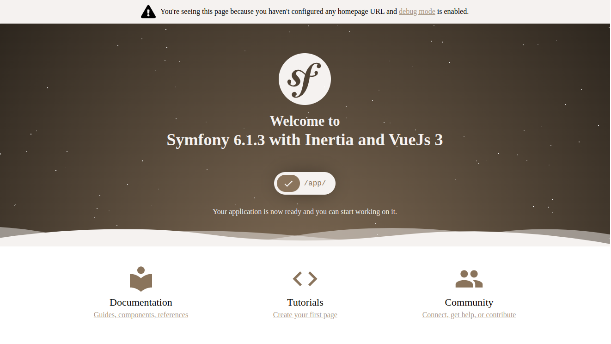
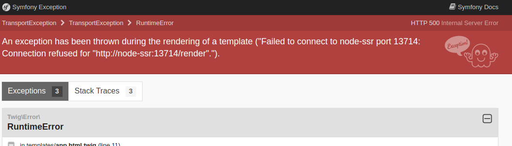

# Symfony + Inertia + Vuejs 3

This is a template for Symfony project with Inertia and Vuejs.

## Using this template

Follow this instruction in creating new repo from this template
https://docs.github.com/en/repositories/creating-and-managing-repositories/creating-a-repository-from-a-template

## Requirements

- PHP 8
- Composer
- Symfony CLI
- Node
- NPM

## Installation and Running

Before you do the steps, make sure you are installed PHP8, Symfony, Composer, NodeJs and NPM.

1. Install PHP Packages using Composer
```shell
composer install
```

2. Next install your node packages using npm
```shell
npm install
```

3. Run symfony server for backend
```shell
symfony server:start
```

4. Run node server for frontend dev env
```shell
npm run dev-serve
```

5. Access http://localhost:8000 in your browser

You would see the modified vue version of symfony welcome



### Using Docker

If you are familiar with Docker container, you can run the application using it.

1. Change the `docker-compose.yml` if necessary like ports mapping to your host
2. Run docker compose
```shell
docker-compose up -d
```
3. Access http://localhost:8000 in your browser

As default the it will map the port of the php to 8000 and inertia node to 8001

## Intertia / Vue Directory

The pages directory is located in `assets/`

- **pages** will be the template that you can use to render in your controller
- **layouts** you can add layouts here

## SSR

Currently, [Symfony Inertia Bundle](https://github.com/rompetomp/inertia-bundle) does not support SSR.

But in this template we added a service that will support ssr and by default this template enable it.

To change this configuration just change your .env files variables

| env                    | description     | type    | default                      |
|------------------------|-----------------|---------|------------------------------|
| APP_INERTIA_SSR_ENABLE | Enables the ssr | boolean | true                         |
| APP_INERTIA_SSR_URL    | The ssr url     | string  | http://node-ssr:13714/render |     

The default for the url is the container of docker setup.

This ssr configuration is following the ssr support of Inertia https://inertiajs.com/server-side-rendering

### Current Problem For Dev Environment

We really make what exactly in the document of inertia, but for some reason the document 
don't have hot reloading of file, for example when user change a page the ssr will not refresh this file
this is due to the `require('page/${name}')` in `ssr.js`, where webpack will compile this with cache
and because of that, it will not get the current file. So far this is just fine for production but for development
environment its a bit annoying that you need to stop + build + start the ssr.

We make a temporary reloading for this by using `nodemon` package of npm, you can check it in the file
[bin/ssr.sh](./bin/ssr.sh), this shell script will be also called in node-ssr container.

While doing a test, this will cause a problem where it's not seamless reloading. If you have large/many files in your assets
the reloading will also take long. And you immediately access the site, there is a tendency you will receive an issue
`An exception has been thrown during the rendering of a template ("Failed to connect to node-ssr port 13714: Connection refused for "http://node-ssr:13714/render".").`
This issue is cause that the nodemon is still recompiling the code. So in few seconds that error should be gone.



## TODO

- [ ] Fix the issue in ssr reloading for dev environment
- [ ] Create a merge request [Symfony Inertia Bundle](https://github.com/rompetomp/inertia-bundle)
  for ssr support this is to remove the service in this template

## References

- [Symfony](https://symfony.com/)
- [Symfony Inertia Bundle](https://github.com/rompetomp/inertia-bundle)
- [Inertia Js](https://inertiajs.com/)
